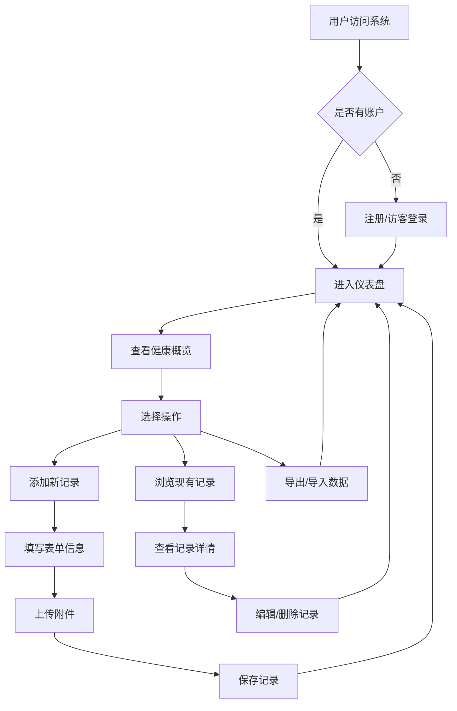

# 个人电子病例档案系统 - 产品需求文档

## 1. 产品概述

个人电子病例档案系统（Personal Health Record, PHR）是一款帮助用户安全存储、管理和查看个人医疗健康信息的Web应用。该系统解决传统纸质病历易丢失、难整理、查询不便等问题，让用户能够随时随地掌握自己的健康状况。

主要目标用户为关心个人健康的普通人群，帮助他们：
- 集中管理就医记录、检验检查结果、处方等医疗文档
- 便捷地查看历史诊疗信息，为医生提供完整病史参考
- 保护隐私安全，数据仅由用户本人掌控

## 2. 核心功能

### 2.1 用户角色

| 角色 | 注册方式 | 核心权限 |
|------|---------|---------|
| 普通用户 | 邮箱注册/访客模式 | 完整的病例档案管理功能 |

### 2.2 功能模块

1. **首页/仪表盘**：健康数据概览、近期记录、最近添加的档案
2. **就医记录管理**：添加、编辑、查看、删除就医记录
3. **检验检查结果**：上传和管理各类检查报告、检验单
4. **处方管理**：处方药品清单、用药记录追踪
5. **健康档案卡片**：生成可视化的健康档案摘要
6. **数据导入导出**：支持JSON格式的数据备份和恢复

### 2.3 页面详情

| 页面名称 | 模块名称 | 功能描述 |
|---------|---------|---------|
| 首页仪表盘 | 健康概览卡片 | 显示统计信息（总记录数、本月就医次数、最近检验等） |
| 就医记录页 | 记录列表/详情卡片 | 按时间线展示就医记录，支持筛选和搜索 |
| 检验检查页 | 结果列表/报告查看器 | 展示各类检查结果，支持图片/PDF预览 |
| 处方管理页 | 处方列表/用药提醒 | 记录处方信息，设置用药提醒时间 |
| 添加/编辑表单 | 通用表单组件 | 统一的表单样式，字段验证 |
| 个人设置页 | 用户信息/数据管理 | 个人信息管理，数据导出/导入 |

## 3. 核心流程

### 3.1 主要用户流程

**添加就医记录流程：**
1. 用户点击「添加记录」按钮
2. 选择记录类型（就医/检查/处方）
3. 填写表单信息（日期、医院、科室、诊断、医嘱等）
4. 可选上传相关文档（检查报告图片等）
5. 保存记录，自动返回列表页并显示新记录

**查看历史记录流程：**
1. 用户进入相应分类页面
2. 浏览按时间倒序排列的记录列表
3. 点击记录卡片查看详细信息
4. 可选择编辑或删除记录

### 3.2 流程图

## 4. 用户界面设计

### 4.1 设计风格

**视觉方向：医疗健康风格 - 清新、专业、可信赖**

采用「医疗白」为主色调，搭配「健康蓝」和「生机绿」作为强调色，营造清洁、专业、值得信赖的视觉氛围。整体风格简约现代，避免过于冰冷或花哨，保持医疗应用的严谨性与亲和力的平衡。

**配色方案：**
- **主色（Primary）**：`#3B82F6` - 专业可信的蓝色
- **次色（Secondary）**：`#10B981` - 健康活力的绿色
- **强调色（Accent）**：`#F59E0B` - 温暖的琥珀色用于提醒
- **背景色（Background）**：`#F8FAFC` - 柔和的浅灰白
- **卡片背景**：`#FFFFFF` - 纯白卡片
- **文字主色**：`#1E293B` - 深蓝灰
- **文字次色**：`#64748B` - 中性灰

**字体选择：**
- 标题字体：`"Noto Sans SC", "PingFang SC", sans-serif` - 现代简洁的中文字体
- 正文字体：`"Inter", "Noto Sans SC", sans-serif` - 高可读性的正文字体
- 数据字体：`"JetBrains Mono", monospace` - 用于日期、数值等

**按钮样式：**
- 圆角按钮（border-radius: 8px）
- 主按钮：蓝色填充，hover时加深5%
- 次要按钮：白色背景，蓝色边框
- 危险操作：红色调

**图标风格：**
- 使用 Lucide Icons 线条图标
- 统一 stroke-width: 2px
- 医疗相关图标：十字、针管、心电图等

**布局风格：**
- 卡片式布局为主
- 顶部固定导航栏
- 左侧边栏导航（桌面端）/ 底部标签栏（移动端）
- 响应式网格系统：3列（桌面）→ 2列（平板）→ 1列（手机）

### 4.2 页面设计概览

#### 首页仪表盘
- **Hero区域**：系统标题、副标题、快速添加按钮
- **统计卡片**：4个关键指标（总记录数、本月就医、待查报告、用药数量）
- **近期记录**：最近5条记录的卡片列表
- **快捷操作**：常用功能入口

#### 就医记录页
- **顶部筛选栏**：时间范围筛选、关键词搜索
- **记录时间线**：垂直时间线布局，年份分隔
- **记录卡片**：日期、医院、科室、诊断摘要
- **详情展开**：点击展开完整信息

#### 检验检查页
- **分类标签**：血液、尿液、影像、超声等分类
- **报告卡片**：缩略图+标题+日期
- **查看器**：全屏查看检查报告图片/PDF

#### 处方管理页
- **处方列表**：药品名称、剂量、用法、时长
- **用药状态**：进行中/已完成标签
- **提醒设置**：可设置下次用药提醒

### 4.3 响应式策略

采用桌面优先设计，逐步适配移动设备：

- **桌面端（≥1024px）**：左侧导航栏 + 右侧内容区，三列卡片网格
- **平板端（768px-1023px）**：收起左侧导航，两列卡片网格
- **移动端（<768px）**：底部标签导航，单列卡片列表，汉堡菜单

触摸优化：
- 按钮最小触控区域：44px × 44px
- 卡片间距充足，避免误触
- 滑动手势支持（移动端）

### 4.4 交互动效

- **页面切换**：淡入淡出 + 轻微上移（300ms ease-out）
- **卡片加载**：交错出现动画（stagger 50ms）
- **按钮交互**：hover缩放1.02 + 阴影加深
- **表单验证**：输入框边框颜色渐变
- **删除确认**：滑动删除 + 撤销提示
- **空状态**：友好的空状态插画和引导文案

## 5. 技术约束与建议

### 5.1 浏览器兼容性
- Chrome/Edge 90+
- Firefox 88+
- Safari 14+
- 不支持 IE 11

### 5.2 性能目标
- 首屏加载时间 < 2秒
- 页面切换 < 300ms
- 支持 1000+ 条记录流畅运行

### 5.3 数据存储
- 使用浏览器本地存储（LocalStorage）
- 考虑 IndexedDB 用于大文件存储
- 数据加密存储保护隐私

### 5.4 可访问性
- 符合 WCAG 2.1 AA 标准
- 支持键盘导航
- 屏幕阅读器友好标签
