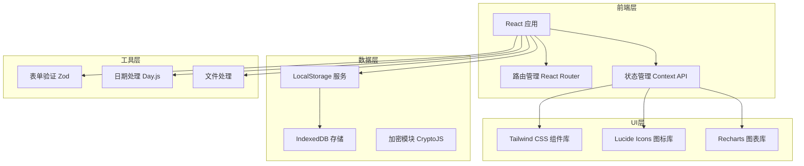
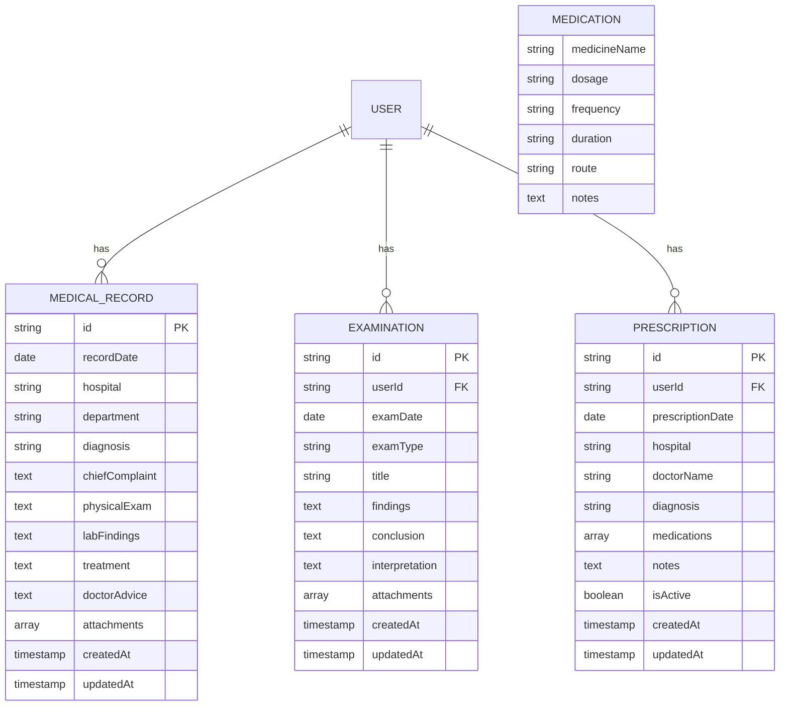
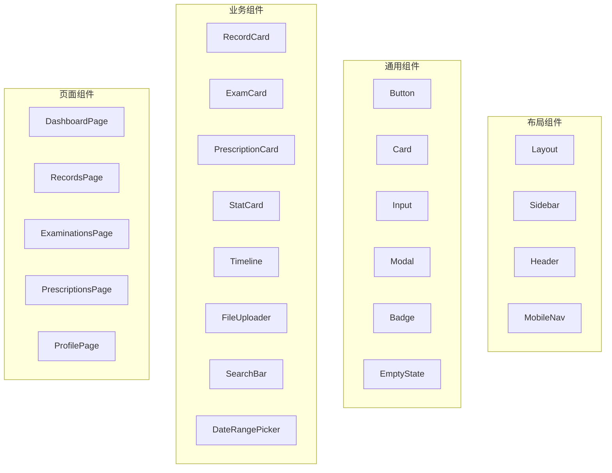

# 个人电子病例档案系统 - 技术架构文档

## 1. 架构设计

本系统采用前后端分离的客户端架构，数据完全存储在用户本地浏览器中，确保隐私安全。



### 架构特点

**单页面应用（SPA）**：使用 React Router 实现无刷新页面切换，提升用户体验。

**本地优先存储**：所有数据存储在用户浏览器本地，无需服务器，保护隐私。

**组件化设计**：高度可复用的 React 组件，统一的 UI 设计语言。

**响应式布局**：Tailwind CSS 提供的响应式工具类，适配多端设备。

## 2. 技术选型

| 技术类别 | 选用技术 | 版本要求 | 说明 |
|---------|---------|---------|------|
| 核心框架 | React | 18.x | 用于构建用户界面 |
| 构建工具 | Vite | 5.x | 快速的开发服务器和构建工具 |
| 路由管理 | React Router DOM | 6.x | SPA 路由解决方案 |
| 样式框架 | Tailwind CSS | 3.x | 原子化 CSS 框架 |
| 状态管理 | React Context + useReducer | 内置 | 轻量级状态管理方案 |
| 数据存储 | LocalStorage / IndexedDB | - | 浏览器本地存储 |
| 表单验证 | Zod | 3.x | TypeScript 优先的验证库 |
| 日期处理 | Day.js | 1.x | 轻量级日期处理库 |
| 图标库 | Lucide React | 0.x | 现代化线条图标 |
| 图表库 | Recharts | 2.x | React 图表组件库 |
| 加密库 | CryptoJS | 4.x | 数据加密存储 |

### 项目初始化命令

```bash
npm create vite@latest health-record -- --template react
cd health-record
npm install react-router-dom tailwindcss postcss autoprefixer
npm install lucide-react recharts zod dayjs crypto-js uuid
npx tailwindcss init -p
```

## 3. 路由定义

| 路由路径 | 页面组件 | 功能描述 |
|---------|---------|---------|
| `/` | Dashboard | 首页仪表盘，健康数据概览 |
| `/records` | MedicalRecords | 就医记录列表页 |
| `/records/add` | AddRecord | 添加就医记录表单 |
| `/records/:id` | RecordDetail | 就医记录详情页 |
| `/records/:id/edit` | EditRecord | 编辑就医记录表单 |
| `/examinations` | Examinations | 检验检查结果列表 |
| `/examinations/:id` | ExaminationDetail | 检查结果详情 |
| `/prescriptions` | Prescriptions | 处方管理列表 |
| `/prescriptions/:id` | PrescriptionDetail | 处方详情页 |
| `/profile` | Profile | 个人设置页 |
| `/settings` | Settings | 系统设置页 |

## 4. 数据模型

### 4.1 数据模型定义



### 4.2 数据定义语言

#### 就医记录表

```typescript
interface MedicalRecord {
  id: string;
  recordDate: string; // ISO 日期格式
  hospital: string;
  department: string;
  doctorName?: string;
  diagnosis: string;
  chiefComplaint: string;
  physicalExam?: string;
  labFindings?: string;
  treatment?: string;
  doctorAdvice?: string;
  followUpDate?: string;
  attachments: Attachment[];
  createdAt: string;
  updatedAt: string;
}
```

#### 检验检查表

```typescript
interface Examination {
  id: string;
  examDate: string;
  examType: ExamType; // 'blood' | 'urine' | 'imaging' | 'ultrasound' | 'ecg' | 'other'
  title: string;
  findings: string;
  conclusion?: string;
  interpretation?: string;
  normalRanges?: NormalRange[];
  attachments: Attachment[];
  createdAt: string;
  updatedAt: string;
}

interface NormalRange {
  item: string;
  value: string;
  unit: string;
  normalRange: string;
}
```

#### 处方表

```typescript
interface Prescription {
  id: string;
  prescriptionDate: string;
  hospital?: string;
  doctorName?: string;
  diagnosis?: string;
  medications: Medication[];
  notes?: string;
  isActive: boolean;
  reminders: Reminder[];
  createdAt: string;
  updatedAt: string;
}

interface Medication {
  name: string;
  dosage: string;
  frequency: string;
  duration: string;
  route: string;
  notes?: string;
}

interface Reminder {
  id: string;
  medicationIndex: number;
  time: string; // HH:mm 格式
  enabled: boolean;
}
```

#### 附件表

```typescript
interface Attachment {
  id: string;
  name: string;
  type: 'image' | 'pdf' | 'document';
  url: string; // Base64 或 IndexedDB blob URL
  size: number;
  uploadedAt: string;
}
```

## 5. 组件架构



## 6. 目录结构

```
src/
├── components/
│   ├── layout/
│   │   ├── Layout.jsx
│   │   ├── Sidebar.jsx
│   │   ├── Header.jsx
│   │   └── MobileNav.jsx
│   ├── common/
│   │   ├── Button.jsx
│   │   ├── Card.jsx
│   │   ├── Input.jsx
│   │   ├── Modal.jsx
│   │   ├── Badge.jsx
│   │   └── EmptyState.jsx
│   ├── records/
│   │   ├── RecordCard.jsx
│   │   ├── RecordForm.jsx
│   │   └── RecordDetail.jsx
│   ├── examinations/
│   │   ├── ExamCard.jsx
│   │   └── ExamDetail.jsx
│   ├── prescriptions/
│   │   ├── PrescriptionCard.jsx
│   │   └── MedicationList.jsx
│   └── dashboard/
│       ├── StatCard.jsx
│       ├── RecentRecords.jsx
│       └── HealthChart.jsx
├── pages/
│   ├── Dashboard.jsx
│   ├── Records.jsx
│   ├── AddRecord.jsx
│   ├── RecordDetail.jsx
│   ├── Examinations.jsx
│   ├── Prescriptions.jsx
│   ├── Profile.jsx
│   └── Settings.jsx
├── context/
│   ├── RecordContext.jsx
│   ├── AuthContext.jsx
│   └── AppContext.jsx
├── services/
│   ├── storage.js
│   ├── crypto.js
│   └── export.js
├── hooks/
│   ├── useRecords.js
│   ├── useExaminations.js
│   └── usePrescriptions.js
├── utils/
│   ├── formatters.js
│   ├── validators.js
│   └── constants.js
├── App.jsx
├── main.jsx
└── index.css
```

## 7. 存储策略

### 7.1 LocalStorage 用途

- 用户偏好设置（主题、语言）
- 认证状态（session token）
- 表单草稿
- 简短配置数据

### 7.2 IndexedDB 用途

- 医疗记录大数据（支持千条以上）
- 附件文件（图片、PDF）
- 离线缓存数据

### 7.3 数据加密

使用 CryptoJS AES 算法对敏感医疗数据进行加密存储：

```javascript
import CryptoJS from 'crypto-js';

const SECRET_KEY = 'user-derived-key';

export const encrypt = (data) => {
  return CryptoJS.AES.encrypt(JSON.stringify(data), SECRET_KEY).toString();
};

export const decrypt = (ciphertext) => {
  const bytes = CryptoJS.AES.decrypt(ciphertext, SECRET_KEY);
  return JSON.parse(bytes.toString(CryptoJS.enc.Utf8));
};
```

## 8. 性能优化策略

### 8.1 代码分割

使用 React.lazy 和 Suspense 实现路由级别的代码分割：

```javascript
const Dashboard = lazy(() => import('./pages/Dashboard'));
const Records = lazy(() => import('./pages/Records'));
```

### 8.2 虚拟列表

对于长列表（千条以上记录），使用虚拟滚动：

```javascript
import { FixedSizeList } from 'react-window';
```

### 8.3 图片优化

- 附件图片压缩存储
- 使用 WebP 格式
- 懒加载非视口内图片

### 8.4 缓存策略

- React Query 缓存频繁访问数据
- 定期持久化状态到本地存储
- 防抖处理高频搜索请求

## 9. 安全考虑

### 9.1 数据安全

- 所有敏感数据本地加密存储
- 不向任何服务器传输用户医疗数据
- 支持数据完全删除

### 9.2 访问控制

- 可设置应用访问密码
- 自动锁屏超时机制
- 无痕模式下禁用存储

### 9.3 数据备份

- 支持 JSON 格式完整导出
- 支持加密备份文件
- 提供数据导入恢复功能
